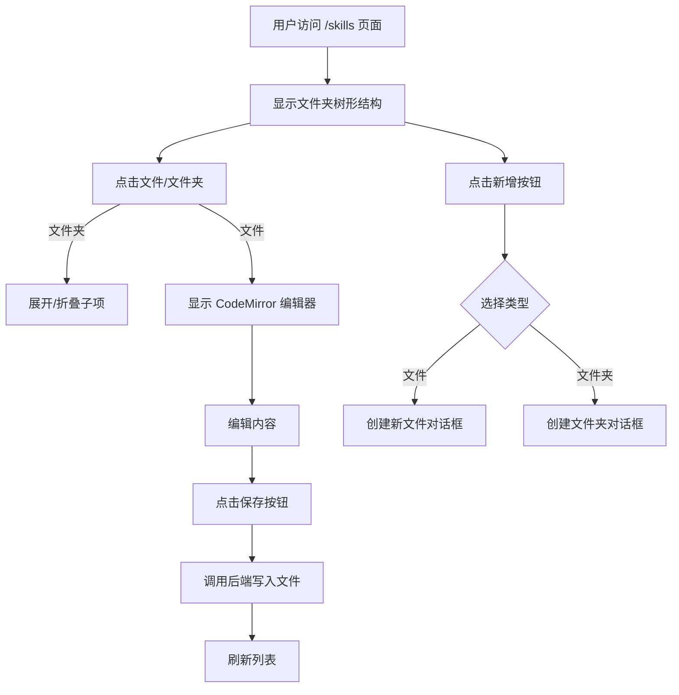
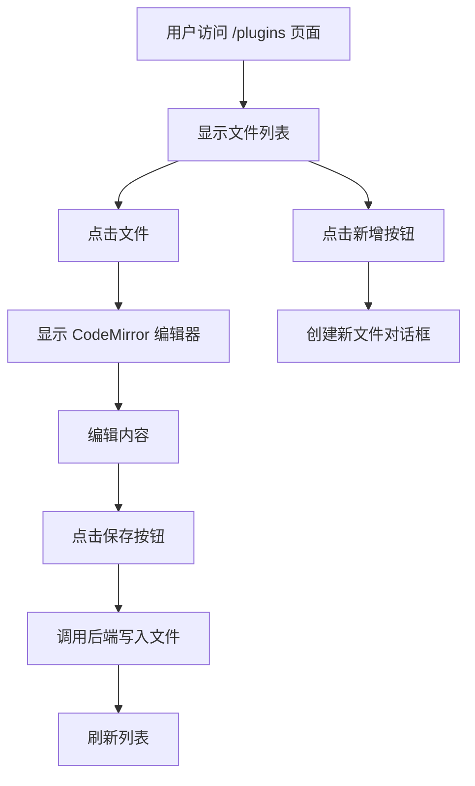

# Skills & Plugins 管理模块需求拆解

## 模块名称
Skills 管理页面 & Plugins 管理页面

## 需求概要
在 CC Mate 应用中新增两个独立页面：
1. **Skills 页面** - 管理 `~/.claude/skills/` 目录，支持文件夹树形结构展示
2. **Plugins 页面** - 管理 `~/.claude/plugins/` 目录，扁平列表展示

复用现有的 Agents 页面设计模式，保持一致的用户体验。

## 用户价值
- 集中管理 Claude Code 的扩展能力配置
- 可视化编辑 Skills 和 Plugins，无需手动操作文件系统
- 与现有 Agents/Commands 页面保持一致的用户体验

---

## 现状分析

### 现有实现模式（Agents 页面）
- **前端组件**: `src/pages/AgentsPage.tsx`
- **数据获取**: React Query hooks (`useClaudeAgents`, `useWriteClaudeAgent`, `useDeleteClaudeAgent`)
- **后端命令**: `read_claude_agents`, `write_claude_agent`, `delete_claude_agent`
- **UI 组件**: Accordion 折叠面板 + CodeMirror 编辑器
- **文件路径**: `~/.claude/agents/*.md`

### 实际目录结构
根据扫描结果：
- **Plugins**: `~/.claude/plugins/` - 当前无文件
- **Skills**: `~/.claude/skills/` - 存在子文件夹结构，如 `translate/SKILL.md`

---

## 需求明细

### 1. 功能模块设计

#### 1.1 页面结构

**Skills 页面** (`/skills`)
```
顶部标题栏
├── 标题: "Skills"
├── 描述: "管理 Claude Code 的 Skills 配置文件"
└── 新增按钮

内容区域
├── 左侧: 文件夹树形结构展示
│   ├── 递归显示 ~/.claude/skills/**/*.md
│   ├── 文件夹展开/折叠
│   └── 文件选中状态
└── 右侧: CodeMirror 编辑器
    ├── Markdown + YAML 高亮
    ├── 保存按钮
    └── 删除按钮
```

**Plugins 页面** (`/plugins`)
```
顶部标题栏
├── 标题: "Plugins"
├── 描述: "管理 Claude Code 的 Plugins 配置文件"
└── 新增按钮

内容区域
├── 左侧: 文件列表展示（Accordion 或 List）
│   └── 显示 ~/.claude/plugins/*.md
└── 右侧: CodeMirror 编辑器
    ├── Markdown + YAML 高亮
    ├── 保存按钮
    └── 删除按钮
```

#### 1.2 导航入口
在 `src/components/Layout.tsx` 的侧边栏中，在 "Agents" 下方新增两个导航项：
```typescript
// Skills
{
  to: "/skills",
  icon: SparklesIcon,  // 需要新增图标导入
  label: "Skills",
},

// Plugins
{
  to: "/plugins",
  icon: PuzzleIcon,  // 需要新增图标导入
  label: "Plugins",
},
```

---

### 2. 前端组件设计

#### 2.1 Skills 页面组件
**文件**: `src/pages/SkillsPage.tsx`

**核心功能**:
- 树形结构展示文件夹层级
- 支持 `~/.claude/skills/**/*.md` 递归读取
- 文件路径显示（如 `~/.claude/skills/translate/SKILL.md`）
- CodeMirror 编辑器支持 Markdown + YAML Frontmatter
- 创建新文件/文件夹对话框
- 加载状态和错误处理

**数据结构**:
```typescript
interface SkillFile {
  name: string;           // 文件名（不含扩展名）
  path: string;           // 相对路径（如 "translate/SKILL"）
  content: string;        // 文件内容
  exists: boolean;
  type: 'file' | 'folder';
  children?: SkillFile[]; // 子文件/文件夹
}
```

#### 2.2 Plugins 页面组件
**文件**: `src/pages/PluginsPage.tsx`

**核心功能**:
- 扁平列表展示（假设 Plugins 不含子文件夹）
- 文件路径显示（如 `~/.claude/plugins/example.md`）
- CodeMirror 编辑器支持 Markdown + YAML Frontmatter
- 创建新文件对话框
- 加载状态和错误处理

**数据结构**:
```typescript
interface PluginFile {
  name: string;
  path: string;
  content: string;
  exists: boolean;
}
```

---

### 3. 后端 Tauri Commands 设计

#### 3.1 Skills 相关命令

**Rust 结构体**:
```rust
#[derive(serde::Serialize, serde::Deserialize, Debug)]
pub struct SkillFile {
    pub name: String,
    pub path: String,      // 相对于 ~/.claude/skills 的路径
    pub content: String,
    pub exists: bool,
    pub file_type: String, // "file" 或 "folder"
    pub children: Option<Vec<SkillFile>>,
}
```

**命令列表**:

1. **`read_claude_skills`**
   - 功能: 递归读取 `~/.claude/skills` 目录
   - 返回: `Vec<SkillFile>` (树形结构)
   - 逻辑:
     - 如果目录不存在，返回空数组
     - 递归遍历子文件夹
     - 读取所有 `.md` 文件内容
     - 按字母顺序排序

2. **`write_claude_skill`**
   - 参数: `skill_path: String`, `content: String`
   - 功能: 写入/创建 skill 文件
   - 路径处理: 支持相对路径（如 "translate/SKILL"）

3. **`delete_claude_skill`**
   - 参数: `skill_path: String`
   - 功能: 删除 skill 文件

4. **`create_skill_folder`**
   - 参数: `folder_name: String`, `parent_path: Option<String>`
   - 功能: 创建新文件夹

#### 3.2 Plugins 相关命令

**Rust 结构体**:
```rust
#[derive(serde::Serialize, serde::Deserialize, Debug)]
pub struct PluginFile {
    pub name: String,
    pub path: String,
    pub content: String,
    pub exists: bool,
}
```

**命令列表**:

1. **`read_claude_plugins`**
   - 功能: 读取 `~/.claude/plugins` 目录
   - 返回: `Vec<PluginFile>`
   - 逻辑: 仅读取一级目录的 `.md` 文件

2. **`write_claude_plugin`**
   - 参数: `plugin_name: String`, `content: String`

3. **`delete_claude_plugin`**
   - 参数: `plugin_name: String`

---

### 4. 数据层设计

**文件**: `src/lib/query.ts`

**新增 Hooks**:

```typescript
// Skills
export const useClaudeSkills = () =>
  useQuery({
    queryKey: ["claude-skills"],
    queryFn: () => invoke<SkillFile[]>("read_claude_skills"),
  });

export const useWriteClaudeSkill = () => {
  const queryClient = useQueryClient();
  return useMutation({
    mutationFn: ({ skillPath, content }: { skillPath: string; content: string }) =>
      invoke<void>("write_claude_skill", { skillPath, content }),
    onSuccess: () => {
      toast.success("Skill saved successfully");
      queryClient.invalidateQueries({ queryKey: ["claude-skills"] });
    },
  });
};

// Plugins (类似结构)
export const useClaudePlugins = () => { ... };
export const useWriteClaudePlugin = () => { ... };
export const useDeleteClaudePlugin = () => { ... };
```

---

### 5. 路由配置

**文件**: `src/router.tsx`

```typescript
import { SkillsPage } from "./pages/SkillsPage";
import { PluginsPage } from "./pages/PluginsPage";

// 在 children 数组中新增两个路由
{
  path: "skills",
  element: (
    <RouteWrapper>
      <SkillsPage />
    </RouteWrapper>
  ),
},
{
  path: "plugins",
  element: (
    <RouteWrapper>
      <PluginsPage />
    </RouteWrapper>
  ),
},
```

---

### 6. 用户操作流程

**Skills 页面流程**:


**Plugins 页面流程**:


---

## 验收标准

### 输入
- **Skills 页面**: 用户访问 `/skills` 路由，点击文件或文件夹
- **Plugins 页面**: 用户访问 `/plugins` 路由，点击文件
- 用户在 CodeMirror 中编辑内容
- 用户点击保存/删除按钮

### 输出
- **Skills 页面**: 正确显示文件树形结构
- **Plugins 页面**: 正确显示文件列表
- CodeMirror 正确加载文件内容（支持 Markdown + YAML 高亮）
- 保存成功后显示 toast 提示，列表自动刷新
- 删除成功后文件从列表中移除

### 通过条件
- [ ] 可以正确读取 `~/.claude/skills` 和 `~/.claude/plugins` 目录
- [ ] Skills 支持子文件夹层级展示
- [ ] 可以创建、编辑、删除文件
- [ ] 可以创建新文件夹（Skills）
- [ ] 编辑器支持语法高亮和行号
- [ ] 保存操作正确写入文件系统
- [ ] 错误处理完善（权限、IO 错误等）
- [ ] 空状态友好提示
- [ ] 两个页面可以独立访问和操作

### 度量指标
- 页面加载时间 < 500ms
- 文件保存成功率 > 99%
- 无 TypeScript 类型错误
- 通过 `pnpm tsc --noemit` 检查

---

## 边界条件

### 异常情况
1. **目录不存在**: 自动创建目录（首次访问时）
2. **文件读取失败**: 显示错误提示，允许用户重试
3. **权限不足**: 明确提示用户权限问题
4. **文件名冲突**: 创建新文件时检查重名，提示用户
5. **内容为空**: 保存时进行校验，阻止空内容保存

### 非目标范围（MVP 阶段不做）
- 文件拖拽上传
- 批量操作（多选删除）
- 文件搜索/过滤
- Git 版本控制集成
- 文件预览模式（只读）
- 语法校验和错误提示

---

## 优先级

### P0（MVP 必须功能）
1. 基础页面路由和导航
2. Skills 文件树形读取和展示
3. Plugins 文件列表读取和展示
4. CodeMirror 编辑器集成
5. 文件保存和删除功能

### P1（重要但可延后）
1. 创建新文件对话框
2. 创建新文件夹（Skills）
3. 空状态和加载状态优化
4. 国际化支持

### P2（增强功能）
1. 文件搜索/过滤
2. 批量操作
3. 文件拖拽重命名
4. 快捷键支持

---

## 模块拆分

### 阶段一：后端 Commands 实现
**文件**: `src-tauri/src/commands.rs`

**任务**:
- [ ] 添加 `SkillFile` 和 `PluginFile` 结构体
- [ ] 实现 `read_claude_skills` - 递归读取 skills 目录
- [ ] 实现 `write_claude_skill` - 写入 skill 文件
- [ ] 实现 `delete_claude_skill` - 删除 skill 文件
- [ ] 实现 `create_skill_folder` - 创建文件夹
- [ ] 实现 `read_claude_plugins` - 读取 plugins 目录
- [ ] 实现 `write_claude_plugin` - 写入 plugin 文件
- [ ] 实现 `delete_claude_plugin` - 删除 plugin 文件

**依赖**: 无

---

### 阶段二：数据层 Hooks
**文件**: `src/lib/query.ts`

**任务**:
- [ ] 添加 `useClaudeSkills` hook
- [ ] 添加 `useWriteClaudeSkill` mutation
- [ ] 添加 `useDeleteClaudeSkill` mutation
- [ ] 添加 `useCreateSkillFolder` mutation
- [ ] 添加 `useClaudePlugins` hook
- [ ] 添加 `useWriteClaudePlugin` mutation
- [ ] 添加 `useDeleteClaudePlugin` mutation

**依赖**: 阶段一完成

---

### 阶段三：类型定义
**文件**: `src/types/index.ts`（或新建 `src/types/skills.ts`）

**任务**:
- [ ] 定义 `SkillFile` 接口
- [ ] 定义 `PluginFile` 接口
- [ ] 导出类型供组件使用

**依赖**: 无

---

### 阶段四：Skills 页面组件
**文件**: `src/pages/SkillsPage.tsx`

**任务**:
- [ ] 创建 Skills 页面组件结构
- [ ] 添加标题 "Skills" 和描述
- [ ] 添加"新增"按钮（支持文件和文件夹）
- [ ] 实现树形结构展示（使用 Collapsible 组件递归）
- [ ] 文件夹展开/折叠交互
- [ ] 文件点击加载编辑器
- [ ] 集成 CodeMirror 编辑器
- [ ] 保存和删除按钮
- [ ] 加载状态和错误处理
- [ ] 空状态提示

**依赖**: 阶段二、阶段三

---

### 阶段五：Plugins 页面组件
**文件**: `src/pages/PluginsPage.tsx`

**任务**:
- [ ] 创建 Plugins 页面组件结构
- [ ] 添加标题 "Plugins" 和描述
- [ ] 添加"新增"按钮
- [ ] 实现文件列表展示（使用 Accordion 或 List）
- [ ] 文件点击加载编辑器
- [ ] 集成 CodeMirror 编辑器
- [ ] 保存和删除按钮
- [ ] 加载状态和错误处理
- [ ] 空状态提示

**依赖**: 阶段二、阶段三

---

### 阶段六：创建对话框组件
**文件**: `src/components/skills-plugins/CreateSkillDialog.tsx` / `CreatePluginDialog.tsx`

**任务**:
- [ ] 创建 Skill 对话框（支持文件夹选择）
- [ ] 创建 Plugin 对话框
- [ ] 表单验证（文件名、路径）
- [ ] 成功后刷新列表

**依赖**: 阶段二

---

### 阶段七：路由配置
**文件**: `src/router.tsx`

**任务**:
- [ ] 导入 `SkillsPage` 和 `PluginsPage`
- [ ] 添加 `/skills` 路由
- [ ] 添加 `/plugins` 路由
- [ ] 配置 RouteWrapper

**依赖**: 阶段四、阶段五

---

### 阶段八：导航菜单
**文件**: `src/components/Layout.tsx`

**任务**:
- [ ] 导入 SparklesIcon（用于 Skills）
- [ ] 导入 PuzzleIcon（用于 Plugins）
- [ ] 在 Agents 下方添加 Skills 导航项
- [ ] 在 Skills 下方添加 Plugins 导航项
- [ ] 配置路由和标签

**依赖**: 无

---

### 阶段九：测试与优化
**任务**:
- [ ] TypeScript 类型检查（`pnpm tsc --noemit`）
- [ ] Skills 页面功能测试（读取、编辑、保存、删除、文件夹操作）
- [ ] Plugins 页面功能测试（读取、编辑、保存、删除）
- [ ] 边界情况测试（目录不存在、权限错误）
- [ ] UI/UX 优化
- [ ] 性能优化（大量文件时的加载速度）

**依赖**: 所有前置阶段完成

---

## 风险与备注

### 不确定性
1. **Plugins 实际结构**: 当前 `~/.claude/plugins` 为空，无法确认实际文件结构。需要根据实际文件格式调整 UI。
2. **Skills 深度**: 目前只发现一层子文件夹，不确定实际项目中的嵌套深度。树形组件需要支持任意深度。
3. **文件格式**: 假设 Skills 和 Plugins 都是 Markdown 文件，如有其他格式需要扩展支持。

### 依赖项
1. 现有的 Agents 页面作为参考实现
2. CodeMirror 6 的 Markdown 和 YAML 语言支持
3. shadcn/ui 的 Accordion、Dialog、Button、Collapsible 等组件

### 设计决策
1. **复用优先**: 尽量复用 Agents 页面的组件和逻辑，减少重复代码
2. **渐进增强**: MVP 先实现基础功能，后续迭代添加高级特性
3. **一致性**: 与现有页面保持视觉和交互一致性

### 技术约束
- 必须使用 TypeScript 严格模式
- 必须通过 `pnpm tsc --noemit` 检查
- 必须遵循项目现有的代码风格（命名、结构等）

---

## 后续优化建议

### 短期优化
1. 添加文件模板功能（新建时提供预设内容）
2. 支持文件重命名操作
3. 添加最近编辑列表

### 长期规划
1. 集成 Claude Code API，直接测试 Skills/Plugins 效果
2. 社区分享功能（导入/导出配置）
3. 可视化 YAML Frontmatter 编辑器
4. 文件版本历史和回滚

---

## 复用性分析

### 可复用的组件/逻辑
1. **Agents 页面结构**: Accordion + CodeMirror 布局
2. **CodeMirror 配置**: Markdown + YAML Frontmatter 扩展
3. **React Query 模式**: useQuery + useMutation + toast
4. **Tauri commands 模式**: 文件读写逻辑
5. **shadcn/ui 组件**: Button, Dialog, ScrollArea, Accordion, Collapsible

### 需要新开发的部分
1. **树形结构展示**: Skills 的文件夹层级（可用 Collapsible 组件递归实现）- ✅ 已完成
2. **路径处理**: 相对路径到绝对路径的转换 - ✅ 已完成
3. **文件夹操作**: 创建新文件夹功能 - ⏸️ 暂未实现（后续规划）

---

## 状态
**已完成** ✅

### 实现摘要
- ✅ 后端 Rust Commands（Skills 和 Plugins 的读写删除）
- ✅ 前端类型定义（SkillFile, PluginFile）
- ✅ React Query Hooks（useClaudeSkills, useClaudePlugins 等）
- ✅ Skills 页面（树形结构展示，支持文件夹展开/折叠）
- ✅ Plugins 页面（Accordion 列表展示）
- ✅ 路由配置（/skills 和 /plugins）
- ✅ 导航菜单更新（SparklesIcon 和 PuzzleIcon）
- ✅ TypeScript 类型检查通过
- ✅ Rust 代码编译通过

### 文件变更列表
**新增文件：**
- `/src-tauri/src/commands.rs` - 添加 Skills 和 Plugins 相关命令
- `/src/components/ui/collapsible.tsx` - 新增 Collapsible 组件
- `/src/pages/SkillsPage.tsx` - Skills 页面组件
- `/src/pages/PluginsPage.tsx` - Plugins 页面组件

**修改文件：**
- `/src-tauri/src/lib.rs` - 注册新的 Tauri 命令
- `/src/lib/query.ts` - 添加 Skills 和 Plugins 的 React Query hooks
- `/src/router.tsx` - 添加 /skills 和 /plugins 路由
- `/src/components/Layout.tsx` - 添加 Skills 和 Plugins 导航项

### 未实现功能
- 暂未添加"新增"按钮（右上角），按需求文档要求后续规划
- 暂未实现创建新文件夹功能（后续规划）
